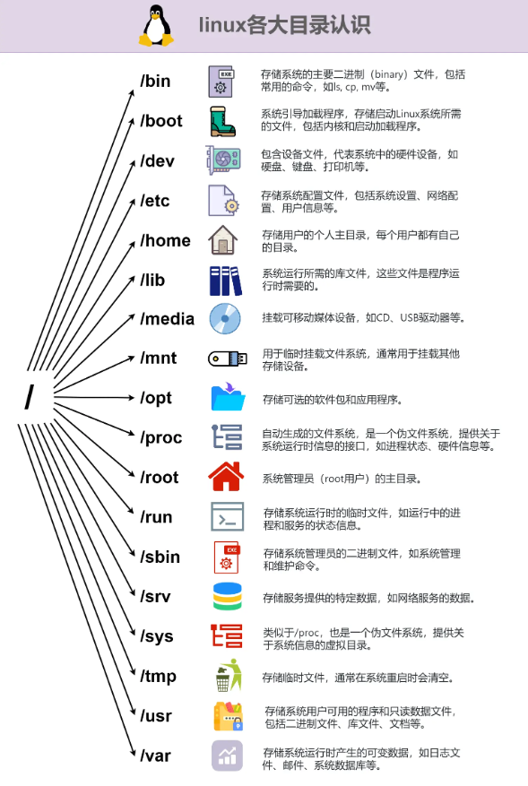
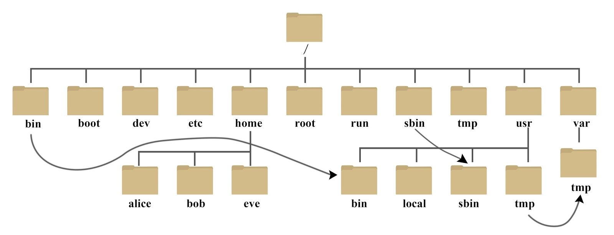
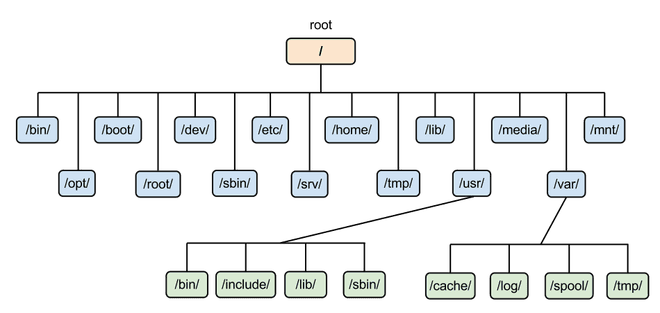

# Linux 基础

# Linux 发行版


# 目录结构






> 1. **/****（根目录）**：整个文件系统的起始点，包含所有其他目录和文件。
> 2. **/bin****（二进制文件）**：包含系统启动和运行时需要的基本命令（如 `ls`、`cp`、`mv` 等）。
> 3. **/boot****（引导文件）**：包含用于系统引导的内核和引导加载程序文件。
> 4. **/dev****（设备文件）**：包含系统中所有设备的文件表示，如硬盘、键盘等。
>    1. **字符设备文件（Character Devices）**：这些文件以字符为单位进行输入和输出，如终端设备、串口设备等。在 `ls -l` 命令下，字符设备文件的开头会显示一个 `c`。
>    2. **块设备文件（Block Devices）**：这些文件以块为单位进行输入和输出，如硬盘、USB 设备等。在 `ls -l` 命令下，块设备文件的开头会显示一个 `b`。
>    - `/dev/sda`：表示第一个 SATA 硬盘。
>    - `/dev/ttyUSB0`：表示 USB 串口设备。
>    - `/dev/null`：一个特殊的设备，所有写入它的数据都会被丢弃（可认为直接删除）。
> 5. **/etc****（配置文件）**：包含系统的配置文件，如网络配置、软件配置等。
>    1. `/etc/apt`
>    2. `/etc/ssh`
>    3. `/etc/ufw`
>    4. `/etc/hosts`
>    5. `/etc/docker`
>    6. `/etc/crobntab`
>    7. `/etc/profile`
>    8. `/etc/passwd`
> 6. **/home****（用户主目录）**：包含用户的个人文件和配置文件。
> 7. **/lib****和****/lib64****（库文件）**：包含系统运行时需要的共享库文件。
> 8. **/media****（可移动媒体设备挂载点）**：用于挂载可移动媒体设备，如光盘、USB 设备等。
> 9. **/mnt****（临时挂载点）**：用于临时挂载其他文件系统。
> 10. **/opt****（可选软件包）**：用于安装可选的<u>第三方软件包</u>。
> 11. **/proc****（进程信息）**：包含当前运行进程的信息，是一个虚拟文件系统。
> 12. **/root****（root 用户主目录）**：root 用户的主目录。
> 13. **/sbin****（系统二进制文件）**：包含系统管理员和维护员使用的系统命令。
> 14. **/tmp****（临时文件）**：用于存放临时文件的目录，重启后会被清空。
> 15. **/usr****（用户软件资源）**：包含用户安装的应用程序和文件。
>     1. `/usr/local`：用户安装的应用一般放在这里
> 16. **/var****（可变数据）**：包含经常变化的文件，如<u>日志文件</u>、缓存文件等。
>     1. `/log`
>     2. `/lock`
>     3. `/tmp`
> 17. `srv`（服务数据）

特殊路径符

- `.`，表示当前，比如./a.txt，表示当前文件夹内的 `a.txt` 文件
- `..`，表示上级目录，比如 `../` 表示上级目录，`../../` 表示上级的上级目录
- `~`，表示用户的 HOME 目录，比如 `cd ~`，即可切回用户 HOME 目录

在文件系统中，路径 `./standalone-logs/` 和 `./standalone-logs` 通常指的是同一个目录，`.` 表示当前目录。

- **./standalone-logs**：这是一个相对路径，表示当前目录下的 `standalone-logs` 文件夹。
- **./standalone-logs/**：这同样是当前目录下的 `standalone-logs` 文件夹，末尾的斜杠 `/` 表示它是一个目录。

在大多数操作系统中，包括类 Unix 系统（如 Linux 和 macOS）和 Windows，尝试访问这两个路径时，它们都会指向同一个位置。然而，需要注意的是，在某些上下文或特定的程序中，路径的结尾斜杠可能用于区分目录和文件，尽管在大多数命令行操作中，这种区分并不明显。

> [!TIP]
> 在类 Unix 系统中，`./a`、`./a/`、`a` 和 `a/` 这四种表达方式表示的含义如下：

1. `./a`：表示当前目录下的名为 `a` 的可执行文件。
2. `./a/`：表示当前目录下的名为 `a` 的文件夹（目录）。
3. `a`：如果当前目录下存在名为 `a` 的可执行文件，则执行该文件；如果不存在，则系统会在 `PATH` 环境变量指定的路径中查找并执行名为 `a` 的可执行文件。如果 `a` 是一个目录，系统会尝试进入该目录。
4. `a/`：表示当前目录下的名为 `a` 的文件夹（目录）。

根据上述解释，这四种表示方式的区别在于指定的文件或目录类型不同：

- `./a` 和 `a` 都可能表示可执行文件，但前者明确指定在当前目录下查找，而后者可能在 `PATH` 中查找。
- `./a/` 和 `a/` 都表示目录，但前者明确指定在当前目录下查找，而后者默认在当前目录下查找。

# linux 常见文件

`/etc/docker/daemon.json` docker 配置文件

`/etc/resolv.conf` DNS 配置

`/etc/ufw` 防火墙规则存放位置中的规则文件（后缀名：.rules）

`/etc/sudoers` sudo 配置

`/etc/profile` 是一个系统级别的 shell 配置文件，它包含着系统的默认环境变量和全局配置。当用户登录系统时，系统会自动执行 `/etc/profile` 文件来设置用户的环境变量和其他设置。这个文件通常用于定义系统范围内的<u>全局环境变量</u>和可执行文件的路径。

`/etc/sudoers` sudo 配置

`/etc/sysctl.conf` 设置内核参数。这些参数主要影响内核的行为，比如网络设置、进程管理、内存管理等。通过修改该文件，用户可以持久化一些内核参数配置，以便在系统启动时自动加载。

`/etc/cloud/cloud.cfg` 是一个配置文件，通常用于配置云服务器上的一些参数和行为。这个文件通常在基于云的虚拟机实例中使用，例如在 AWS EC2、Google Cloud Compute Engine、Azure VM 等上。它包含了一系列的配置选项，用于定义云实例的行为，比如网络配置、主机名设置、用户数据等。

以下是一些可能包含在 `/etc/cloud/cloud.cfg` 中的常见配置选项：

1. network: 这部分配置网络相关的设置，比如是否配置静态 IP 地址、是否启用 DHCP 等。
2. hostname: 定义云实例的主机名。
3. users: 这个部分允许你配置系统用户和用户组，以及相关的属性。
4. ssh_pwauth: 是否允许使用密码验证 SSH 登录。
5. growpart: 这部分用于指定是否自动扩展云磁盘的分区。
6. cloud_init_modules: 定义哪些模块将在云初始化时执行。
7. cloud_config_modules: 定义哪些模块将在云配置时执行。
8. cloud_final_modules: 定义哪些模块将在云初始化结束时执行。

`/bin` 二进制文件的常规存放位置指向 `/usr/bin`，通常包含了一些基本的系统命令和工具，如 Bash、Dash 等

/var/log  系统日志文件

/proc    进程文件夹，里面的 pid 对应不同进程，cwd 对应的是启动路径

> 在 Linux 系统中，`/proc` 目录是一个特殊的虚拟文件系统，提供了对系统和进程信息的访问。其中，`/proc/<PID>/fd` 目录包含了进程的文件描述符信息。
>
> 具体来说，`/proc/1` 表示进程 ID 为 1 的进程，通常是 init 进程或 systemd 进程，也就是系统的第一个用户空间进程。在 Linux 系统中，这个进程是系统启动的第一个进程，负责初始化系统并启动其他进程。
>
> 在 `/proc/1/fd` 目录下，包含了进程 1 的文件描述符信息。每个文件描述符都是一个符号链接，指向进程打开的文件或设备。其中，`/proc/1/fd/1` 表示进程 1 的文件描述符 1，即标准输出（stdout），`/proc/1/fd/2` 表示进程 1 的文件描述符 2，即标准错误输出（stderr）。
>
> 通过将输出重定向到 `/proc/1/fd/1` 和 `/proc/1/fd/2`，可以将容器中的输出信息和错误信息发送到主机的标准输出和标准错误输出，方便进行日志记录和监控。这种方式可以让容器的输出信息与宿主机的输出流进行交互。

# 中断信号

1. **SIGINT**** (2)【INT】**：由终端按下 `Ctrl + C` 时发送给前台进程，通常用于中断（Interrupt）进程的执行。
2. **SIGKILL (9)**：用于强制终止进程，进程无法捕获或忽略这个信号。
3. **SIGTERM (15)**：请求进程终止（Terminate）的信号，通常用于优雅地终止进程。
4. **SIGHUP (1)**：通常表示终端连接断开，通常会让进程重新加载配置或重启。
5. **SIGSTOP (19)**：暂停（Stop）进程的执行，进程会被挂起而不会被终止。
6. **SIGCONT (18)**：恢复（Continue）之前被暂停的进程。
7. **SIGUSR1 (10)** 和 **SIGUSR2 (12)**：用户自定义的信号，可以被应用程序自定义使用。
8. **SIGSEGV (11)**：表示进程访问了无效的内存地址，通常是段错误（Segmentation Fault）。

退出状态码（exit status code）

- 退出状态码为 0 表示命令成功执行，没有发生错误。
- 非零的退出状态码通常表示命令执行过程中出现了某种问题或错误，具体的非零值通常会有不同的含义，可以根据具体的命令或程序来解释。

因此，当你看到命令输出 `0|1`，这可能表示命令的退出状态码为 0 或 1，其中 0 表示成功，1 可能表示某种错误或异常情况。要了解确切的含义，需要查看命令的文档或上下文来解释这些退出状态码的含义。

```bash
**0**：表示程序成功执行并正常退出。
**1-125**：通常用于表示程序执行过程中发生了某种错误或异常情况，具体含义可以根据程序的设计而有所不同。
1 一般性未知错误
2 不适用的shell或语法错误
**126**：表示无法执行程序，可能是因为程序文件不可执行。
**127**：表示找不到要执行的命令，或者命令不可执行。
**128**：通常用于表示程序因为收到了信号而退出，退出状态码为 128 加上信号编号。无效退出参数 例如，如果程序因收到 SIGINT 信号而退出，退出状态码为 128 + 2 = 130。
**130**：通常表示程序被用户中断（例如通过 Ctrl + C）。
**255**：表示退出状态码超出了合法范围。
```

# 常用快捷键

1. **基本操作快捷键**：

   - `Ctrl + C`：中断当前程序的执行。
   - `Ctrl + Z`：将当前程序挂起（暂停），并放入后台运行。
   - `Ctrl + D`：表示输入结束，通常用于退出终端或结束输入流。结束键盘输入(End Of File，EOF
   - `Ctrl + L`：清屏，相当于执行 `clear` 命令。
2. **光标移动快捷键**：

   - `Ctrl + A` 或 `Home`：将光标移动到行首。
   - `Ctrl + E` 或 `End`：将光标移动到行尾。
   - `Ctrl + U`：删除光标之前的所有内容。
   - `Ctrl + K`：删除光标之后的所有内容。
3. **历史记录和命令补全快捷键**：

   - `Ctrl + R`：在历史记录中搜索命令。
   - `Tab`：自动补全命令或文件名。
   - `Ctrl + P` 或 向上箭头：查看上一个历史命令。
   - `Ctrl + N` 或 向下箭头：查看下一个历史命令。
4. **其他常用快捷键**：

   - `Ctrl + S`：暂停屏幕输出。
   - `Ctrl + Q`：恢复屏幕输出。
   - `Ctrl + T`：交换当前字符和前一个字符的位置。
   - `Ctrl + W`：删除光标前的一个单词。

# 环境变量 PATH

全局环境变量

```bash
printenv

echo $PATH
# /usr/local/sbin:/usr/local/bin:/usr/sbin:/usr/bin:/sbin:/bin:/usr/games:/usr/local/games:/snap/bin
```

设置 PATH 变量：将 PATH 变量设置为 `/usr/bin` 和 `/bin` 两个目录的列表。这意味着当你运行一个命令时，系统会先检查 `/usr/bin` 目录，如果在那里找不到，再检查 `/bin` 目录。这两个目录通常包含许多常用的命令和工具。

```bash
export PATH=/usr/bin:/bin
```

然而，通常情况下，PATH 变量在系统启动时就已经通过配置文件（如 `~/.bashrc`、`~/.profile` 或 `/etc/environment`）被设置好了，并且包含了多个目录，而不仅仅是/usr/bin 和/bin。因此，直接将其设置为只包含这两个目录可能会导致一些命令不可用，因为它们可能位于其他默认不在 PATH 中的目录中。在实际使用中，你可能会看到类似这样的命令来添加目录到 PATH：

`export PATH=$PATH:/new/directory`

> `/etc/profile` 为全局环境变量

```bash
# /etc/profile: system-wide .profile file for the Bourne shell (sh(1))
# and Bourne compatible shells (bash(1), ksh(1), ash(1), ...).
# /etc/profile 是 Bourne shell 及其兼容 shell 的系统范围的 .profile 文件。

if [ "${PS1-}" ]; then
  # 检查是否存在 PS1 变量。PS1 是提示符变量，如果存在并且非空，说明当前是一个交互式 shell。
  
  if [ "${BASH-}" ] && [ "$BASH" != "/bin/sh" ]; then
    # 检查 BASH 变量是否存在且不等于 /bin/sh，以确定是否运行的是 Bash shell，而不是其他 shell。

    # The file bash.bashrc already sets the default PS1.
    # PS1='\h:\w\$ '
    # bash.bashrc 文件已经设置了默认的 PS1 提示符样式。

    if [ -f /etc/bash.bashrc ]; then
      . /etc/bash.bashrc
      # 如果 /etc/bash.bashrc 文件存在，则通过 . /etc/bash.bashrc 命令执行该文件。
      # 这个文件通常包含 Bash 的默认配置和提示符设置。
    fi
  else
    if [ "`id -u`" -eq 0 ]; then
      PS1='# '
      # 如果不是 Bash shell，则根据当前用户是否为 root 用户设置提示符。
      # id -u 命令返回用户的 UID，如果 UID 为 0，表示是 root 用户，提示符设置为 # 。
    else
      PS1='$ '
      # 否则设置为普通用户的提示符 $ 。
    fi
  fi
fi

if [ -d /etc/profile.d ]; then
  # 检查 /etc/profile.d 目录是否存在。
  
  for i in /etc/profile.d/*.sh; do
    if [ -r $i ]; then
      . $i
      # 遍历 /etc/profile.d 目录下所有以 .sh 结尾的脚本文件，并执行每一个可读的脚本文件（通过 . $i 命令）。
    fi
  done
  unset i
  # 用 unset i 清除变量 i，以防止污染环境变量。
fi
```

1. **临时配置环境变量**：在命令行中直接设置环境变量，这种设置<u>只在当前会话中有效</u>。例如，要设置环境变量 `MY_VARIABLE` 为 `my_value`，可以执行以下命令：

```bash
export MY_VARIABLE=my_value
```

1. **永久配置用户级环境变量**：编辑当前用户的配置文件，如 `~/.bashrc` 或 `~/.bash_profile`，并在其中添加您的环境变量设置。编辑完成后，使用 `source` 命令使更改生效，例如：

```bash
source ~/.bashrc
```

1. **永久配置系统级环境变量**：
   设置全局的环境变量，可以编辑 `/etc/environment` 文件，并在其中添加您的环境变量设置。这会影响系统中所有用户的环境变量。
2. **使用****export****命令**：
   使用 `export` 命令将环境变量设置为全局变量。例如：

```bash
sudo export MY_VARIABLE=my_value
```

使用 `echo $MY_VARIABLE` 来检查它是否已正确设置。
